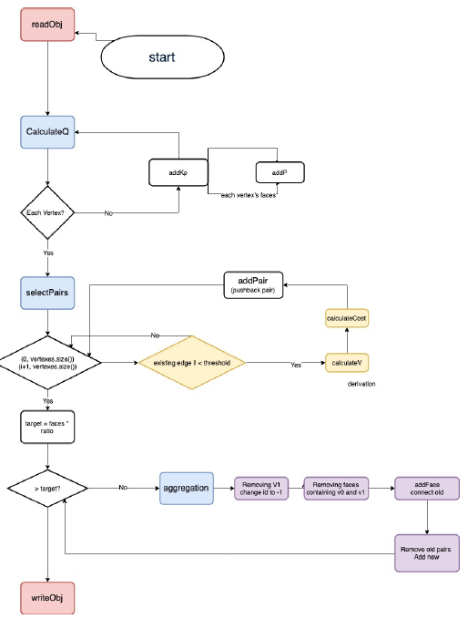
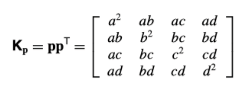
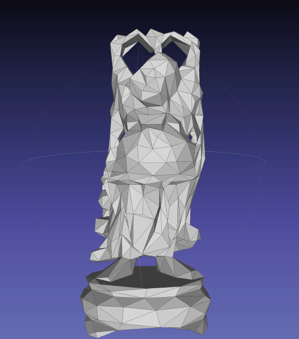
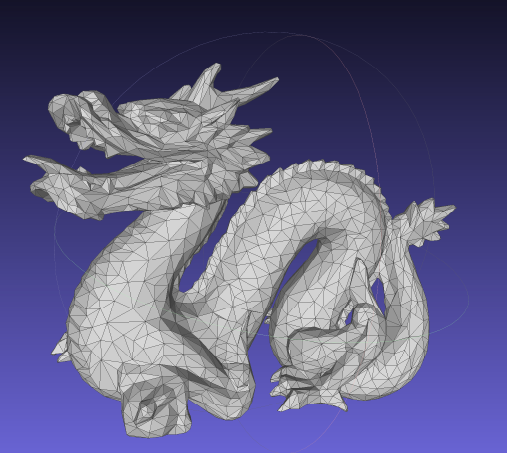

# 网格简化实验报告


## 一. 代码使用说明

​		代码在CLION平台下编写，使用C++实现。可以使用cmake .命令生成makefile文件，并且使用make命令即可生成可执行文件。

### 1.1 使用方法

​		使用./Simplication_refined input output ratio, 即输入obj路径，输出obj路径，简化比（期待面数/原面数）即可实现简化。如果未指定参数，将使用main.cpp内置的默认路径进行简化。

### 1.2 本地环境

- macOS 10.14.5
- 2.6 GHz Intel Core i7, 16 GB RAM
- cmake_minimum_required VERSION 3.13

## 二. 算法流程



​	根据论文以及我的实现方式，整个程序可以用如上的流程图表示。所有的对外接口和函数在Mesh类中定义。除此之外，还定义了Pair类、Pairheap类、Vertex类以及Face类，这些均可以在各自的头文件中可以找到。

- readObj : 读入文件

- calculateQ : 计算每个顶点的Q矩阵，其中Q矩阵等于每个点的所有面的Kp矩阵相加。其中Kp的定义为

- 在计算好了所有点之后，我们即选择Pair点对，根据论文提到的方法，将所有边选为点对，如果两个点的距离小于某一阈值，则也被选为点对。在程序中，我给定阈值THRESHOLD为0.01

  - 在生成Pair的过程中，需要计算$\overline{V}$和 Cost，其中$\overline{Q}$由Q1 + Q2计算，根据论文，如果两点要收缩，我们需要选择一个能使Cost最小的点，Cost使用$V^T QV$计算，也就是对于

    进行求导。得到V的结果是

    ，值得注意的是，右边的矩阵可能是不可逆的，在这种情况下，我们使用p1和p2的终点作为我们选择的$\overline{V}$

- 之后我们需要做的就是将pair进行塌缩，我们使用一个小顶堆的数据结构，每次塌缩，弹出一个Cost最小的值，我选择对于(v0, v1)，删除v1，将v0更新为新的点，然后将原本和v1相关的面全部更新为v0，然后将原来与v1相关的pair删除，更新为v0。删除与更新的策略之后叙述。

- writeObj : 写入文件

## 三. 代码实现

### 1. Mesh.h

​		最上层类，除了对外接口之外，还存储了如下内容。

```c++
class Mesh {
public:
    int fcnt = 0, vcnt = 0;	//当前点的数量和边的数量
    std::vector<Vertex> vertexes;	//点的集合
    std::vector<std::set<int> > edges; //存储边，邻接矩阵
    Heap heap;		//pair堆
};
```

​		在实际实现过程中，我并没有统一存储面，而是对于每个顶点存储了三角面片。

###2. FaceVertex.h

​		主要实现了面类和点类。

- Face类
  - 面的表示：为了可以让Face在std::set中可以很好的工作，我将三个点序号的最小值移动到了数组的第一个位置（循环移动，不破坏原来的法向量方向）
  - 为了使用std::set，我还重载了<符号（c++ set的工作原理是如果a < b 且 b < a 都返回false的情况下判断重复），<符号依次比较三个顶点的id即可。
- Vertex类
  - 存储id、Q矩阵，xyz，以及包含的面的Set
  - 删除和添加的时候调用removeFaceDirectly、addFace即可

### 3. Pair

​		每个Pair存储了v0、v1的编号，$\overline{V}$ 以及cost，还有一个时间戳time，pair需要重载<运算符以便于使用stl中的算法进行排序。重载的依据是cost的大小。对于pair，我们对于v0，v1进行排序，以便于后面std::map的使用

###4. Heap

​		我在调整Heap的过程中经历了一个困难的优化过程

####4.1 初始版本

​		Pair用std::vector存储，然后使用std::make_heap建堆，使用std::pop_heap弹出堆。每当我将v0, v1进行塌缩时，我需要将v1删除，然后更新所有带v0的点对，之后重新使用make_heap进行建堆，这样是一个非常耗时的操作。后来，我虽然实现了网格简化的功能，但是我的网格简化的速度实在是太慢了。

#### 4.2 优化版本

​		就在我走投无路的时候，我在github上找到了<https://github.com/aronarts/MeshSimplification>，作者的方法给了我非常多的灵感。

- 首先我发现，c++的std::priority_queue优先队列本身就是一个堆，这样就可以避免使用vector这样的通用容器，堆的结构被自动维护。
- 引入了时间戳的概念，具体策略是使用std::map<std::pair<int, int>, int>，将pair映射到一个int，当一个新的pair加入的时候，我们将mapper和该pair的时间戳设置成一样，当我们需要删除某个pair的时候，我们只需要将mapper中对应的时间戳设置成-1，这样就完全不需要对于所有vector进行遍历，我们只需要在每次pop_heap的时候检查当前pair的时间戳是否有效即可。

​	这样的优化方式让我的代码速度实现了质的飞跃。


## 四. 其它优化

#### 对于点对的选择

​		习题课提到了关于点对选择的复杂度问题，对于点对的选择，除了边之外，我们本来需要对于所有的可能的点对进行遍历，如果它们的距离小于我们的阈值，那么被选择。这样我们的复杂度是O(N^2) ，但是实际上我们不需要这么高的复杂度，一个可行的策略是将点对按照x进行排序，本来是两层for循环，但是当第二层for循环的x之差大于阈值时，我们就可以剪枝。

```c++
 for (int i = 0; i < vertexes.size(); ++i) {
        int a = index[i], b;
        for (int j = i + 1; j < vertexes.size(); ++j) {
            b = index[j];
            if (vertexes[a].distance(vertexes[b]) < THRESHOLD)
                addPair(a, b);
            if(vertexes[b].dim[0] - vertexes[a].dim[0] > THRESHOLD)
                break;
        }
    }
```

​		std::sort排序的复杂度是O(nlogn),剪枝之后的速度明显优于原来的n^2算法。


## 五. 运行速度与效果展示

​		取t = 0.01，对于dragon模型进行不同简化比的简化。使用剩余所有点的Q和坐标计算Cost。

| 简化比 | 简化时间/s | Cost        |
| ------ | ---------- | ----------- |
| 0.1    | 34.9248    | 2.1726e-05  |
| 0.2    | 28.4115    | 3.5499e-06  |
| 0.3    | 26.4033    | 1.20944e-06 |
| 0.4    | 24.3442    | 5.31388e-07 |
| 0.5    | 30.3909    | 2.57685e-07 |

​		可以看到，简化比越小，Cost值越小，所花时间越小。

​		对于其它模型取ratio = 0.01的时候的参数

| 模型     | 简化时间/s | Cost        |
| -------- | ---------- | ----------- |
| budda    | 14.9514    | 5.98511e-05 |
| arma     | 4.04801    | 0.000405543 |
| bunny    | 63.8971    | 6.20713e-09 |
| dinosaur | 0.187577   | 0.475443    |
| kitten   | 2.86912    | 0.00103647  |

​		其中bunny的运行很长时间的原因是，bunny本身坐标的差值较小，在THRESHOLD = 0.01的情况下，有很多的pair被选择，导致运行时间增加。




<center>buddha_0.01
</center>



<center>dragon_0.03, 面片数6267


## 六. 收获

​		本次网格简化大作业很好的提升了我的代码能力，我不断学习了各种stl的用法，例如map、pair、priority_queue的用法。以及在程序的各个地方使用了全新的c++ for循环，感觉收获颇丰。此外简化后的网格还用到了我的渲染大作业中，可谓是一举双得，感谢助教！
